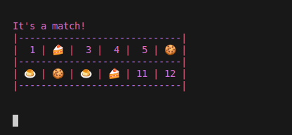

# Memory (matching card game)
A game where you flip over cards and try to find matches

## Includes

*   **Different player amounts** Can either be a single player game against the clock, 2 player game with someone there, or a game against the computer
*   **Difficulty levels** can play with 6, 12, 24, and 48 cards!


## Installation
*   To play you must have a Linux to download and run the pre-compiled executable. 
*   A terminal or command prompt application is required as well/

## How to download and run

1. *Download* Get the executable from the itch.io page (LINK HERE)
2. *Navigate* Open the terminal and go to the directory you want to open it in
3. *Execute* Run the game with this command
    ```bash
    .\matching
    ```

## How to play
*   Choose the number of players
*   Choose the number of cards
*   Flip over cards to reveal what they are
*   If they are a match, it will say so and they will remain flipped upright, otherwise they will go back to black after 3 seconds
*   Repeat this process, switching turns, until all cards are matched



## Building from source

If you want to compile the game yourself, you will need a C++ compiler (eg. g++)
1. **Clone Repository**
2. **Build and launch game**
    i.e. source launch